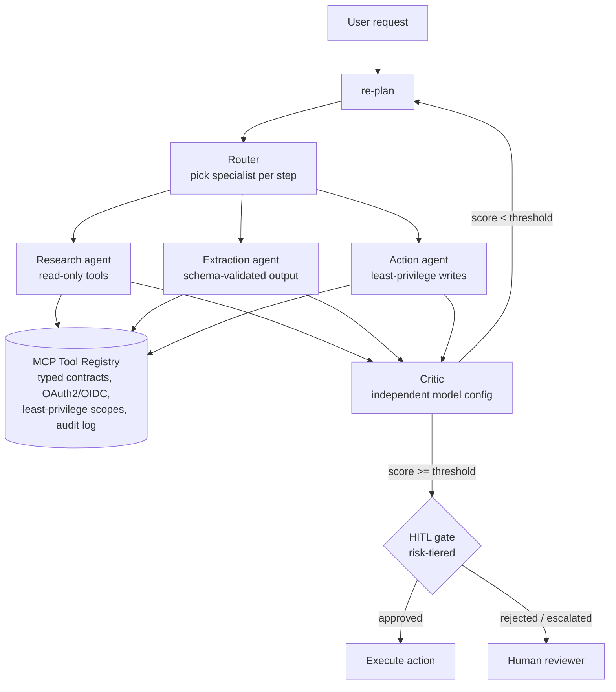

# agentic-ai-patterns

> **About this repo:** Reference architecture demonstrating production patterns from my work in enterprise GenAI — illustrative implementation, not a client project. Tools, plans, and critic scores are simulated locally; no model calls, no network calls, no real data.

A multi-agent orchestration reference: planner → router → specialist agents → independent critic, with an MCP-style tool registry and human-in-the-loop gates on consequential actions. Runs as a pure-Python demo.

## Architecture



## How to run

```bash
python run_demo.py
```

Sample output walks through a ticket-triage scenario: plan → tool calls → critic scores → a HITL gate on the write action (simulated approval in demo mode).

## Design decisions

1. **Orchestrated multi-agent over single agent.** Triage spans systems (KB, tickets, notifications). One agent holding every tool means one confused or compromised step has every capability at once. Specialists get least-privilege tool sets; the planner composes them.
2. **MCP tool registry over point-to-point integrations.** N systems × M agents multiplies auth models and audit gaps. One registry with typed contracts, per-call identity, and a full audit trail means new systems plug in behind the same contract.
3. **Independent critic, different model configuration.** The critic must fail differently from the planner — correlated failures are the enemy. The loop iterates until the critic score clears the threshold or max iterations trigger escalation.
4. **Risk-tiered HITL gates on actions, not answers.** Reads flow freely; writes above a risk threshold wait for approval. Approvers see the plan, the evidence, and the diff — never a bare "approve?" button.

## Tradeoffs

| Choice | Gained | Cost |
|---|---|---|
| Multi-agent | Blast-radius containment, specialized prompts | Orchestration complexity, more model calls |
| MCP registry | Reuse, uniform auth/audit | Platform work with no demo value until 3rd integration |
| Critic loop | Self-correction, bounded retries | Latency per iteration; needs a real threshold tuned on evals |
| HITL on writes | Safety on consequential actions | Human latency; gate fatigue if tiers are wrong |

## Repo layout

```
agent/loop.py    # planner → router → specialist → critic loop (simulated)
agent/tools.py   # mock tools: search_kb, get_ticket, draft_summary, update_ticket
agent/gates.py   # risk tiers + HITL gate logic
run_demo.py      # ticket-triage demo scenario
```
