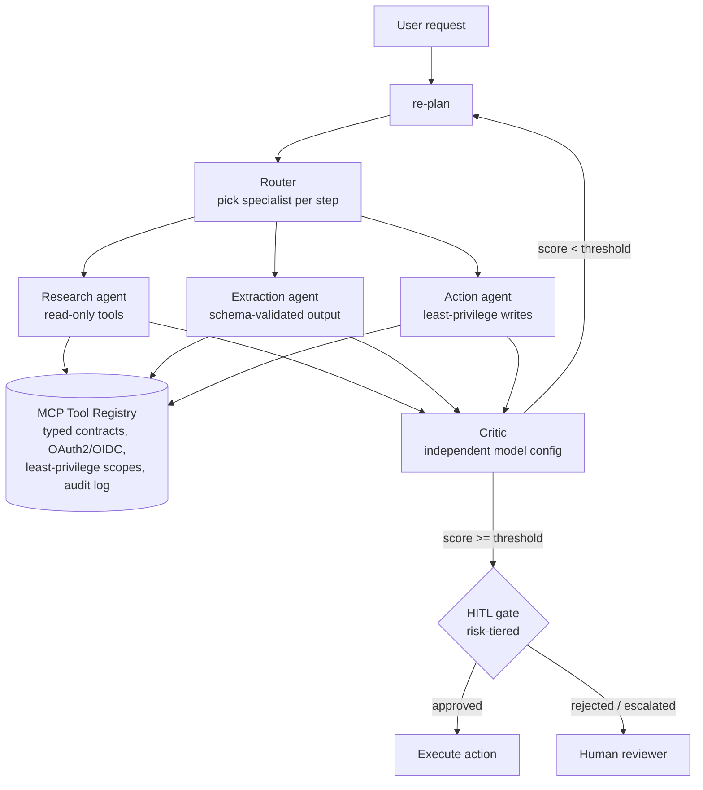

# agentic-ai-patterns

[](https://github.com/ttripathi167/agentic-ai-patterns/actions/workflows/ci.yml)

> **About this repo:** Reference architecture demonstrating production patterns from my work in enterprise GenAI — illustrative implementation, not a client project. Tools, plans, and critic scores are simulated locally; no model calls, no network calls, no real data.

**Watch an agent think.** A multi-agent orchestration reference — planner → router → specialist agents → independent critic → human-in-the-loop gates — running a 10-task synthetic benchmark suite end to end. Nine tasks solve in 1–3 critic rounds; one is *designed* to fail the critic and escalate, because the escalation path is the feature.

```bash
python run_demo.py          # staged, colorized terminal narrative
python run_demo.py --fast   # same run, no dramatic pauses (what CI runs)
```

## Architecture



## Measured behavior

From `docs/BENCHMARKS.md` — measured on a local illustrative run (synthetic data):

| Iterations to solve | Tasks |
|---|---|
| 1 round | 4 |
| 2 rounds | 3 |
| 3 rounds | 2 |
| Escalated to human | 1 (`change-freeze`: critic never cleared 0.80) |

The critic is seeded and deterministic — re-running the suite reproduces these tables exactly.

## Docs

- [`docs/BENCHMARKS.md`](docs/BENCHMARKS.md) — measured tables: per-task results, critic-score trajectory, tool-call counts, escalation drill
- [`docs/PRODUCTION.md`](docs/PRODUCTION.md) — productionizing notes: what breaks first at 10×/100×, latency budget, cost model, top 5 failure modes + mitigations, threat model, observability
- [`docs/adr/`](docs/adr/) — architecture decision records:
  - [ADR-001](docs/adr/001-multi-agent-orchestration.md): orchestrated multi-agent vs. single agent
  - [ADR-002](docs/adr/002-independent-critic.md): independent critic design
  - [ADR-003](docs/adr/003-hitl-gates.md): human-in-the-loop gates and the risk-tier model

## Design decisions

1. **Orchestrated multi-agent over single agent.** Triage spans systems (KB, tickets, notifications). One agent holding every tool means one confused or compromised step has every capability at once. Specialists get least-privilege tool sets; the planner composes them. → [ADR-001](docs/adr/001-multi-agent-orchestration.md)
2. **MCP tool registry over point-to-point integrations.** N systems × M agents multiplies auth models and audit gaps. One registry with typed contracts, per-call identity, and a full audit trail means new systems plug in behind the same contract.
3. **Independent critic, different model configuration.** The critic must fail differently from the planner — correlated failures are the enemy. The loop iterates until the critic score clears the threshold or max iterations trigger escalation. → [ADR-002](docs/adr/002-independent-critic.md)
4. **Risk-tiered HITL gates on actions, not answers.** Reads flow freely; writes above a risk threshold wait for approval. Approvers see the plan, the evidence, and the diff — never a bare "approve?" button. → [ADR-003](docs/adr/003-hitl-gates.md)

## Tradeoffs

| Choice | Gained | Cost |
|---|---|---|
| Multi-agent | Blast-radius containment, specialized prompts | Orchestration complexity, more model calls |
| MCP registry | Reuse, uniform auth/audit | Platform work with no demo value until 3rd integration |
| Critic loop | Self-correction, bounded retries | Latency per iteration; needs a real threshold tuned on evals |
| HITL on writes | Safety on consequential actions | Human latency; gate fatigue if tiers are wrong |

## Repo layout

```
agent/loop.py        # planner → router → specialist → critic loop (simulated)
agent/tasks.py       # 10-task synthetic benchmark suite
agent/tools.py       # mock tools: search_kb, get_ticket, draft_summary,
                     #   update_ticket, label_ticket, notify_oncall
agent/gates.py       # risk tiers + HITL gate logic
run_demo.py          # staged colorized demo across all 10 tasks
scripts/benchmark.py # regenerates docs/BENCHMARKS.md from a live run
docs/BENCHMARKS.md   # measured tables (synthetic data)
docs/PRODUCTION.md   # productionizing notes
docs/adr/            # architecture decision records
.github/workflows/ci.yml  # Python 3.11/3.12: compile, demo, benchmarks
```
